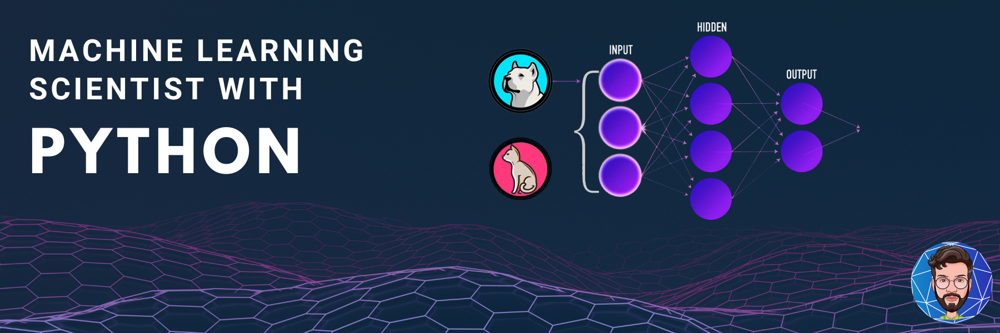
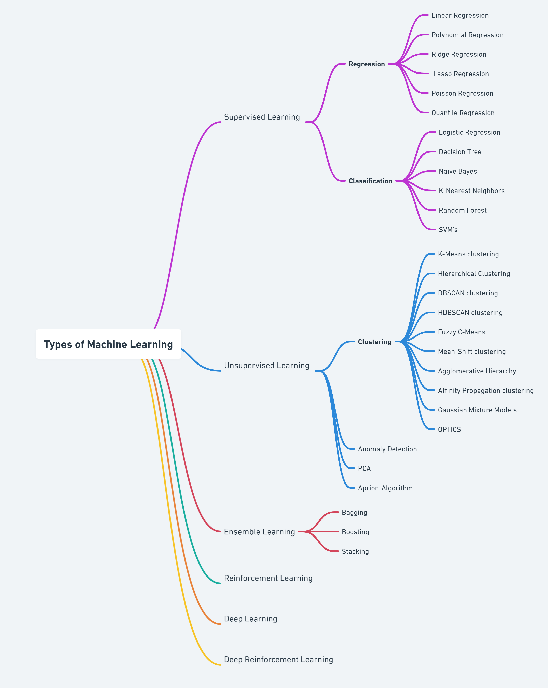

# CAREER TRACK - Machine Learning Scientist with Python

 

  

### **DEFINATIONs**:
 > Machine learning is the art of defining the **loss function** suited to the dataset and then minimizing them.

 > McKinsey has defined machine learning as “*algorithms that can learn from data without relying on rules-based programming.*”

> Machine learning is an application of AI that enables systems to learn and improve from experience without being explicitly programmed. Machine learning focuses on developing computer programs that can access data and use it to learn for themselves.
> 
### **Types of Machine Learning**

 

  

### **LEARNING TRACK**
---
1. [**Supervised Learning with scikit-learn**](https://github.com/mohd-faizy/CAREER-TRACK-Machine-Learning-Scientist-with-Python/tree/main/01_Supervised%20Learning%20with%20scikit-learn)

2. [**Unsupervised Learning in Python**](https://github.com/mohd-faizy/CAREER-TRACK-Machine-Learning-Scientist-with-Python/tree/main/02_Unsupervised%20Learning%20in%20Python)

3. [**Linear Classifiers in Python**]()

4. 

  

#### $\color{skyblue}{\textbf{Connect with me:}}$

[][twitter]
[][linkedin]
[][Portfolio]

[twitter]: https://twitter.com/F4izy
[linkedin]: https://www.linkedin.com/in/mohd-faizy/
[Portfolio]: https://mohdfaizy.com/

---

